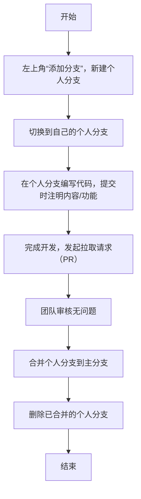

# COMP2113-GP

This project is a group assignment related to COMP2113.

## Members:
- Song Sizhe 3036457247 @TIP-SoNg (Group Leader)
- Lu Yixuan 3036481066 @Joao-luri
- Zhang Tianyi 3036481731 @wi11iamZhang
- Zhang Zhou Yihan 3036517255 @Beckettsapere824

*(Ranking is not in any particular order)*

### 开发流程步骤说明（我只能先放在这里，等我们代码写完了我改一下）

0. **在issue里面选择自己想写什么，并且在负责那里把自己选上**

1. **建个自己的"小窝"——新建个人分支**  
   先瞅左上角那"添加分支"的按钮，点它！建一个只属于你的分支。记住啊，这步是为了啥？就怕你写的代码不小心霍霍了主分支，先给自己划个安全区，稳得一批！

2. **切换阵地——切到自己的分支**  
   分支建好了别愣着，赶紧切换到你刚建的那个分支里。就跟换个工作台似的，接下来所有活儿都在这儿干，主分支那边暂时别碰！

3. **埋头苦干——写代码+提交**  
   打开你的代码编辑器，在自己的分支里咔咔写代码。写完一段或者一个小功能，赶紧提交！提交的时候别偷懒，简明扼要写清楚：“我改了啥”、“加了啥功能”，比如“修复了登录按钮bug”、“新增了用户头像上传功能”，方便后面大家瞅明白。

4. **喊人瞅一眼——发起拉取请求**  
   你觉得自己这波活儿干完了，没问题了，就发起个“拉取请求”（Pull Request）。这一步是喊大家过来看看，你写的东西合不合规矩，有没有坑。

5. **通关！合并+删分支**  
   大伙儿瞅完了，说“中，没问题”，那就把你的分支合并到主分支里。合并完事儿，你那个临时用的个人分支就没用了，直接删了，干干净净，不占地方！

