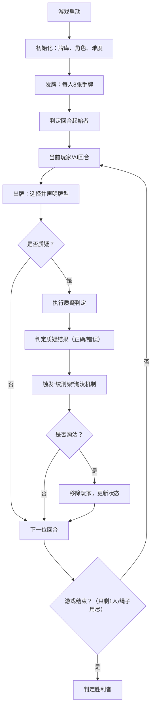

# 《王权，革命，社会》游戏规则与开发分工

## 一、游戏背景
设定于**中世纪F国大革命时期**，4方势力（民权代表、帝皇、教皇、骑士）的代表通过“出牌-质疑”的博弈进行权力谈判，模拟信息欺诈与权力淘汰的过程。

## 二、核心玩法逻辑树

## 三、详细规则说明

### 1. 牌库设定
- **牌型分类**：
  - 常规牌：`皇权`（10张）、`神权`（10张）、`民权`（10张）。
  - 特殊牌：`革命`（1张，**万能牌**，判定时等价于任意牌）、`调和`（1张，**无用牌**，判定时不等价于任何牌）。
- **发牌规则**：游戏开始时，每位玩家从混洗牌库中抽取8张手牌。

### 2. 角色设定（4位代表，玩家选1位，其余AI控制）
| 角色        | 玩家选择时的特性（手牌强制包含） | AI/玩家控制时的“强制质疑”规则（对下一位角色） |
|-------------|----------------------------------|----------------------------------------------|
| 民权代表    | 每回合手牌**必含1张特殊牌**（“革命”/“调和”随机1张） | 下一位是“骑士”时，**必定质疑**其出牌         |
| 帝皇        | 每回合手牌**必含1张皇权**         | 下一位是“教皇”时，**必定质疑**其出牌         |
| 教皇        | 每回合手牌**必含1张神权**         | 下一位是“民权代表”时，**必定质疑**其出牌     |
| 骑士        | 每回合手牌**必含1张民权**         | 下一位是“帝皇”时，**必定质疑**其出牌         |

### 3. 难度设定（4个等级，影响淘汰、表达、AI行为）
| 难度   | 绞刑架绳子数量 | 淘汰机制特殊性                     | 表达系统（AI角色）| AI“质疑”目标选择       |
|--------|----------------|------------------------------------|--------------------|------------------------|
| Noob   | 5根            | 仅**最后1根绳子**触发“绞刑”淘汰    | 所有表达**全为真话** | 不优先选择人类玩家     |
| Normal | 5根            | 正常（每根绳子被选时，概率均等淘汰） | 表情为真，**小概率说谎** | 正常（按规则选目标）|
| Ex     | 3根            | 正常                               | 不输出表情，**小概率说谎** | 正常（按规则选目标）|
| Hard   | 3根            | 正常                               | 不运行表达系统      | 角色特性判定失效，纯逻辑判定 |

### 4. 博弈流程（出牌→质疑→淘汰）
1. **出牌**：玩家/AI在回合内选1张手牌（可如实/欺骗声明牌型）。
2. **质疑**：下一位玩家/AI可选择“质疑”：
   - 质疑时，判定“出牌声明”与“实际牌型”是否一致（`革命`视为“任意牌”，`调和`视为“无判定牌”）。
   - 不质疑则进入下一位回合。
3. **质疑结果与淘汰**：
   - 质疑正确：**出牌者**触发“绞刑架”（选1根绳子，按难度规则判定是否淘汰）。
   - 质疑错误：**质疑者**触发“绞刑架”（选1根绳子，按难度规则判定是否淘汰）。

## 四、代码模块分工（C++，无第三方库，命令行界面）

### 1. 模块划分与职责
| 模块名称       | 核心职责                                                                 | 关键类/函数示例（供参考）|
|----------------|--------------------------------------------------------------------------|----------------------------------------|
| `CardSystem`   | 管理牌型定义、牌库初始化、发牌、牌型判定（含特殊牌逻辑）| `class Card`（牌属性）、`class Deck`（洗牌/发牌） |
| `RoleSystem`   | 管理4类角色的特性、强制质疑逻辑、玩家角色初始化                         | `class Role`（角色类型、特性方法）|
| `Difficulty`   | 根据难度配置绞刑架、表达系统、AI行为规则                                 | `class DifficultyConfig`（难度参数封装） |
| `UI`           | 命令行交互（显示手牌、选择出牌/质疑、显示表情/淘汰提示等）| `class CLI`（输入/输出函数）|
| `GameFlow`     | 串联回合流程（起始者判定、出牌、质疑、淘汰、胜利判定）| `class Game`（`playTurn()`、`handleChallenge()`等） |
| `AISystem`     | 控制AI角色行为（出牌选择、质疑选择、表达系统输出）| `class AI`（`chooseCardToPlay()`、`outputExpression()`等） |

### 2. 核心模块框架
#### （1）`CardSystem`：牌与牌库管理
#### （2）`RoleSystem`：角色特性与强制质疑
#### （3）`Difficulty`：难度参数配置
#### （4）`UI`：命令行交互
#### （5）`GameFlow`：游戏主流程
#### （6）`AISystem`：AI行为控制（简化）
#### （7）主函数：启动游戏

## 五、开发建议
1. **分步实现**：先完成**核心流程**（发牌、出牌、质疑、淘汰），再扩展角色特性、难度逻辑、AI智能行为。
2. **UI优化**：命令行界面注重**操作引导**（清晰提示当前可选操作、状态）。
3. **AI迭代**：从“随机行为”逐步升级为“策略性行为”（如根据历史出牌调整欺骗/质疑概率）。
4. **测试重点**：优先验证**特殊牌（革命/调和）的判定逻辑**与**角色强制质疑规则**，确保核心博弈公平性。

